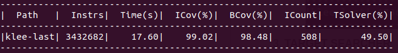

## Pokretanje

1) Docker
	- neophodno je imati instaliran docker
	- git clone https://github.com/salesh/klee.git
	- cd klee
	- docker build -t klee/klee .
	- docker run --rm -ti --ulimit='stack=-1:-1' klee/klee
	- cd klee_src/test/search-target-test
	- clang -I ../../include -emit-llvm -c -g -O0 -Xclang -disable-O0-optnone test-1.c
	- klee --search=target-searcher --target-function=better_with_dfs test-1.bc 


2) Instaliranje u okviru host masine na linuxu, upustvo na linku http://klee.github.io/build-llvm60/<br/>
Napomena: U osmom koraku (Get KLEE source) treba klonirati ovaj repozitorijum

## Način upotrebe nove pretrage

```klee --exit-on-error --search=target-searcher --target-function=ime_funkcije ime_fajla.bc```<br/>  
Dakle, potrebno je navesti naziv pretrage **target-searcher**, zatim naziv funkcije u kojoj će biti primenjena DFS pretraga i ime odgovarajućeg .bc fajla. 

## Rezultati

U folderu target-searcher-stats nalazi se statistika upotrebe bfs, dfs i target-search pretraga pozivom klee alata sa parametrom --exit-on-error.
1) **BFS**
	- ```klee --exit-on-error --search=bfs test-1.bc```
	
	- ```klee --exit-on-error --search=bfs test-2.bc```
	
2) **DFS**
	- ```klee --exit-on-error --search=dfs test-1.bc```
	
	- ```klee --exit-on-error --search=dfs test-2.bc```
	
3) **TARGET SEARCHER**
	- ```klee --exit-on-error --search=target-searcher --target-function=better_with_dfs test-1.bc```
	
	- ```klee --exit-on-error --search=target-searcher --target-function=better_with_dfs test-2.bc```
	
  
Ova statistika pokazuje da ako označimo odgovarajuću funkciju (u kojoj će se izvršiti DFS pretraga) prilikom poziva target-searcher-a možemo dobiti bolje rezultate nego primenom samo BFS ili samo DFS pretrage. Najvažniji deo jeste izbor funkcija u kojima će se izvršiti DFS pretraga, tj unaped trebamo odrediti takve funkcije.

## Primeri

Test fajlovi na kojima se može istestirati rad algoritma mogu se naći u folderu /test/search-target-test<br/>
Poziv za test-1.bc: ```klee --exit-on-error --search=target-searcher --target-function=better_with_dfs test-1.bc``` 
